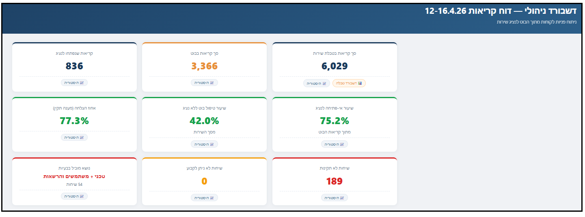

# Bot Analytics Dashboard

<p align="center">
  
</p>

**AI-powered analytics pipeline for customer service chatbot monitoring and optimization**

An end-to-end system that transforms raw customer service call data into actionable management insights. Built as a modular pipeline of 5 specialized AI agents, each handling a distinct analysis layer — from topic classification and response quality evaluation to a fully interactive executive dashboard.

---

## Live Dashboard

🔗 [View Live Dashboard](https://amitrubin10.github.io/daily-bot-dashboard/)

---

## The Pipeline

The system processes raw service call data through 5 sequential stages:

### Stage 1 — Topic Classification Agent
Ingests raw call reports (Excel/CSV) and classifies every customer inquiry into predefined service categories. Outputs topic distribution with counts, percentages, and full call details per topic.

### Stage 2 — QA Quality Agent
Analyzes the same report from a quality perspective. Evaluates each bot response as valid, invalid, or indeterminate based on defined criteria. Produces a conservative success rate and flags problematic responses.

### Stage 3 — Merge & Insights Agent
Cross-references both analyses by call ID into a single managerial document. Adds envelope data (total service volume, bot usage rate), generates training insights, and produces an executive summary with KPI metrics.

### Stage 4 — Service Branch Dashboard
Generates a separate dashboard from weekly service call data, showing branch-level performance: call volume per branch, close rates, customer counts, software version distribution, and module installations.

### Stage 5 — Executive Dashboard Generator
Produces the final interactive HTML dashboard, combining all metrics into a single view: KPI cards with historical trends, topic distribution charts, funnel analysis, quality breakdown, and drill-down into every problematic conversation — with a direct link to the branch dashboard.

---

## Dashboard Features

- **9 KPI cards** with click-to-view weekly trend charts (pure SVG, no external libraries)
- **Topic distribution** — bar charts and detail tables for all calls and for problematic calls separately
- **Funnel diagram** — visual flow from bot users → agent escalation → top issue topics
- **Interactive conversation explorer** — click any question to reveal the bot's actual response
- **Historical comparison** — week-over-week trend tracking across all metrics
- **Branch dashboard link** — integrated access to service performance by branch
- **Fully self-contained** — single HTML file, works offline, no server required

---

## Tech Stack

| Component | Technology |
|-----------|-----------|
| Analysis Agents | Python, Claude AI (custom skills) |
| Data Processing | openpyxl, pandas |
| Dashboard | HTML5, CSS3, Vanilla JavaScript |
| Charts | Pure inline SVG (no external chart libraries) |
| Hosting | GitHub Pages |
| Data Storage | Embedded in HTML + Excel history file |

---

## Architecture

```
Raw Call Report (xlsx)          Weekly Service Report (xlsx)
        │                                │
        ▼                                ▼
┌─────────────────┐            ┌──────────────────┐
│ Topic Classifier │            │ Branch Dashboard  │
│   (Agent 1)      │            │   (Agent 4)       │
└────────┬────────┘            └────────┬─────────┘
         │                              │
         ▼                              │
┌─────────────────┐                     │
│  QA Analyzer     │                     │
│   (Agent 2)      │                     │
└────────┬────────┘                     │
         │                              │
         ▼                              │
┌─────────────────┐                     │
│  Merge Agent     │                     │
│   (Agent 3)      │                     │
└────────┬────────┘                     │
         │                              │
         ▼                              ▼
┌──────────────────────────────────────────┐
│         Executive Dashboard              │
│            (Agent 5)                     │
│  ┌────────────────────────────────────┐  │
│  │ KPIs │ Charts │ Funnel │ History  │  │
│  └────────────────────────────────────┘  │
└──────────────────────────────────────────┘
```

---

## Key Design Decisions

**No external chart libraries** — Charts are rendered as pure inline SVG. The dashboard is often opened from local file paths where CDN scripts fail silently. Pure SVG guarantees consistent rendering everywhere.

**Single-file output** — Each dashboard is a self-contained HTML file with all data, styles, and scripts embedded. No build step, no dependencies, no server.

**Modular agents** — Each analysis stage is an independent skill that can be run, tested, and improved separately. The pipeline is composable: run any subset of stages as needed.

**Historical tracking** — KPI values are automatically logged to an Excel history file after each run, enabling week-over-week trend analysis without manual data entry.

---

## Screenshots

<p align="center">
  
</p>
<p align="center">
  
</p>
<p align="center">
  
</p>
<p align="center">
  
</p>
<p align="center">
  
</p>
<p align="center">
  
</p>

---

## Status

In active production use. Updated weekly with live data.

---

## Author

**Amit Rubin**
ERP & AI Operations Lead | QA, Automation & Product at Hashavshevet (Wizsoft)
